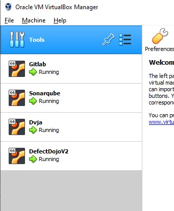
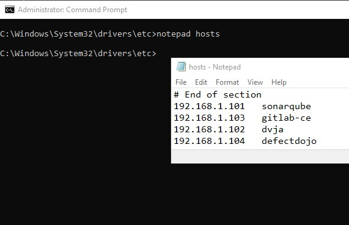

# WssDevSecOps
WSS DevSecOps In Action
## Tools Involve In This Tutorial
* Infra setup = Virtual Box
* Code repository = Gitlab-CE
* CI pipeline jobs = Gitlab-Runner
* SAST = Sonarqube
* SCA = Dependency-check
* Secrets scanning = Gitleaks
* DAST = Owasp Zap
* Vulnerability mgmt tool = Defect-Dojo
* Target/vulnerable apps = DVJA (Java application with maven)
### Virtual Box
1. If using virtualbox, enable 2 network adapters.
   * Adapter 1, configure as NAT.
   * Adapter 2, configure as Host-only.
   * For every vbox image, if using ubuntu as base use netplan to configure static IP.
       ```
       network:
           ethernets:
               enp0s3:
                   dhcp4: true
               enp0s8:
                   addresses:
                       - 192.168.x.x/24 # the static ip
           version: 2
       ```
   * Once the file save and exit, run `$ sudo netplan apply` to make the configuration effective.
2. The objective is to have every solution setup in Virtual Box.
    
3. To easier connect per each instance, create entry in hosts file for each instance.
   * In Windows
     * Run cmd as administrator
     * Go to directory as image below and run `notepad hosts`. Add suggested hosts and save.
       
   * In Linux
     * From terminal, run `$ nano /etc/hosts`. Add suggested hosts as image above.
### Gitlab-CE
1. Gitlab-ce as code repository and ci pipelines
2. Setup gitlab-ce
   * Link to refer https://computingforgeeks.com/how-to-install-gitlab-ce-on-ubuntu-linux/
3. Login gitlab-ce
   * To get gitlab-ce initial password, from the shell terminal in gitlab-ce machine:
        ```
        $ grep 'Password:' /etc/gitlab/initial_root_password
        ```
   * Configure external_url.
        ```
        $ vi /etc/gitlab/gitlab.rb

        # --> press i
        # at line 32, change external_url 'http://gitlab-ce/'
        # --> press Esc > shift+: > wq > Enter

        $ gitlab-ctl reconfigure
        $ exit
        ```
   * Access Gitlab at `http://gitlab-ce` (if already set in hosts file) or go to as IP address set earlier `http://<ip-addr>`
        ```
        username: root
        password: <output-from-command-at-step-1>
        ```
### Gitlab-Runner
1. Gitlab-Runner to run Gitlab CI jobs. Link to refer https://docs.gitlab.com/runner/install/
2. Once install, to register in `http://gitlab-ce`, at dvja project go to `Settings > CI/CD > Runners`. Take note on registration token.
3. At host which gitlab-runner already installed, run command to register gitlab-runner.
    ```
    $ gitlab-runner register --url http://gitlab-ce/ --registration-token <token-from-step-2>
    ```
4. Fill up the details. Just HIT ENTER to follow default details. Please make sure to choose `docker` as executor. Some sample below may different with yours.
    ```
    Enter the GitLab instance URL (for example, https://gitlab.com/):
    [http://gitlab-ce/]: HIT ENTER
    Enter the registration token:
    [<token>]: HIT ENTER
    Enter a description for the runner:
    [e5c5d3c3ef88]: dvja
    Enter tags for the runner (comma-separated):
    dvja
    Enter optional maintenance note for the runner:

    Registering runner... succeeded                     runner=GR1348941Ezg4zQn6
    Enter an executor: docker, docker-ssh, docker-ssh+machine, kubernetes, custom, parallels, shell, ssh, virtualbox, docker+machine:
    docker
    Enter the default Docker image (for example, ruby:2.7):
    alpine:latest
    Runner registered successfully. Feel free to start it, but if it's running already the config should be automatically reloaded!

    Configuration (with the authentication token) was saved in "/etc/gitlab-runner/config.toml"
    ```
5. Verify configuration at gitlab-ce.
    
6. Click icon pencil at runner. Checked `Run untagged jobs` and verify config as below.
    
7. Edit config.toml in gitlab-runner container.
    ```
    $ vi /etc/gitlab-runner/config.toml
    
    # --> press i
    # change `privileged = false` to `privileged = true`
    # add `extra_hosts = ["gitlab-ce:172.18.0.3"]` --> below "volumes.." | IP refer to IP in docker network
    # --> press Esc > shift+: > wq > Enter

    $ exit
    ```
### Sonarqube
1. Sonarqube as SAST tool. Link to refer https://medium.com/@HoussemDellai/setup-sonarqube-in-a-docker-container-3c3908b624df
2. Tutorial will setup Sonarqube with docker. Please ensure VM for Sonarqube ready with docker.
3. Requirement to run sonarqube https://docs.sonarqube.org/latest/requirements/requirements/#header-4
   * Add this value in /etc/sysctl.conf
       ```
       vm.max_map_count=524288
       fs.file-max=131072
       ```
   * And run this to get the value effective
       ```
       $ sudo sysctl -p /etc/sysctl.conf
       ```
4. Access Sonarqube at `http://sonarqube:9000`. Once login with credential below will require change to new password.
    ```
    username: admin
    password: admin
    ```
### Dependency-check
1. Dependency-check as SCA tool (integrate with Sonarqube).
2. First enable Dependency-Check plugin in Sonarqube at Administration > Marketplace. Search the plugins, install and reboot the server.
3. Link to refer to integrate plugin in scanning https://github.com/dependency-check/dependency-check-sonar-plugin
4. For this DVJA project which use maven, integrate plugin with maven https://jeremylong.github.io/DependencyCheck/dependency-check-maven/
### DVJA
1. DVJA as vulnerable app and staging server. Original project can be refer at https://github.com/appsecco/dvja
2. For this project, customized DVJA can be download from this repository. Details can be refer at `To Start DevSecOps` as next section.
3. Please ensure VM for DVJA ready with docker.
### Defect-Dojo
1. DefectDojo as vulnerability management tool. Link to refer https://github.com/DefectDojo/django-DefectDojo#quick-start
2. Please ensure VM for DefectDojo ready with docker.
## To Start DevSecOps
1. If in Windows, use WSL2 Ubuntu and link with Docker-Desktop. Easy to manage with VS Code connect to WSL2 (https://code.visualstudio.com/docs/remote/wsl).
2. Clone this repository in WSL2 Ubuntu, set permission as read and enter the directory.
    ```
    $ sudo git clone https://github.com/wssnetwork/wssdevsecops
    $ sudo chown -R <user> wssdevsecops/dvja
    $ cd wssdevsecops/dvja
    ```
3. Run `$ docker-compose up` to make the app running.
4. Access DVJA at `http://dvja:8080`. No user, will need to register if want to play DVJA.
### To use DVJA codebase and push to local Gitlab
1. Create blank project in gitlab-ce `http://gitlab-ce` as below. 
    
3. Once project created, run git init in dvja directory. (can follow step as suggest in gitlab-ce page)
    ```
    $ git init --initial-branch=main
    $ git config --global user.email "youremail@yourdomain.com"
    $ git config --global user.name "your username"
    $ git config --global --add safe.directory /wssdevsecops/dvja
    $ git remote add origin http://gitlab-ce/root/dvja.git
    $ git add .
    $ git commit -m "initial commit"
    $ git push -u origin main
    ```
4. Verify project uploaded in gitlab-ce.
# Things To Do
* screenshot step for setup Sonarqube
* screenshot step for setup DefectDojo