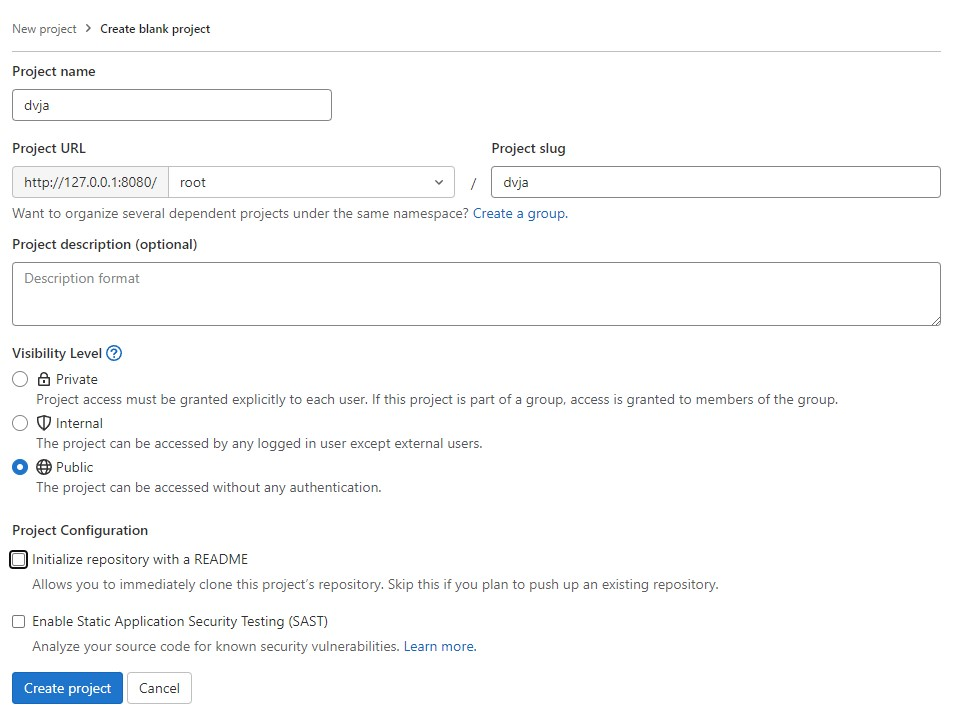
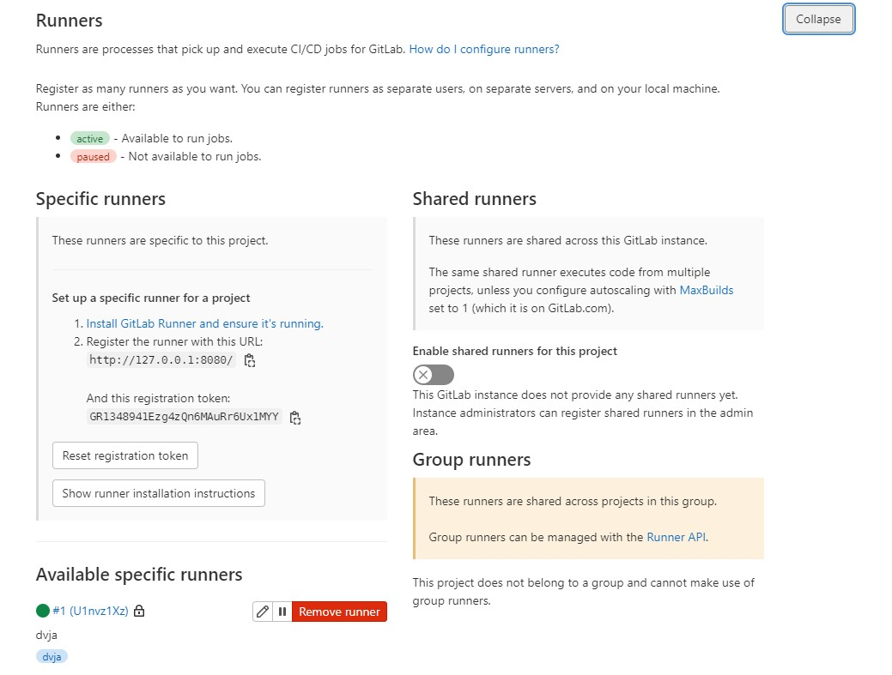
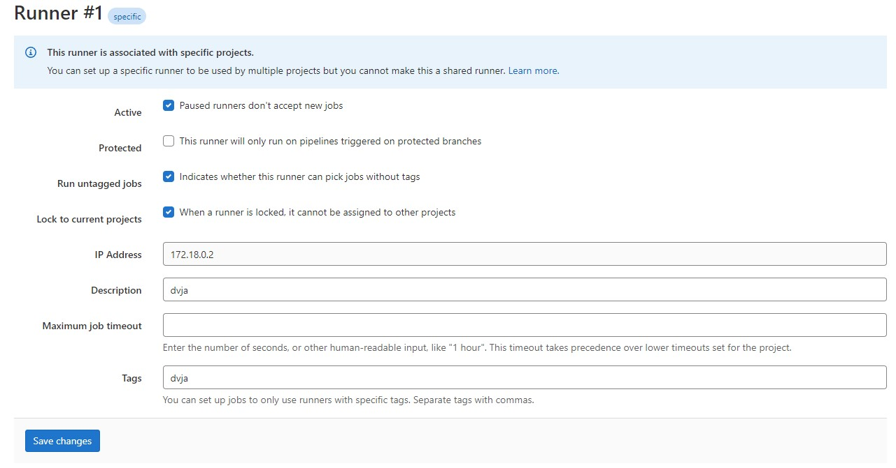

# WssDevSecOps
WSS DevSecOps In Action
## To start
1. If in Windows, use WSL2 Ubuntu and link with Docker-Desktop. Easy to manage with VS Code connect to WSL2 (https://code.visualstudio.com/docs/remote/wsl).
2. Requirement to run sonarqube https://docs.sonarqube.org/latest/requirements/requirements/#header-4.
    Add this value in /etc/sysctl.conf
    ```
    vm.max_map_count=524288
    fs.file-max=131072
    ```
    And run this to get the value effective
    ```
    $ sudo sysctl -p /etc/sysctl.conf
    ```
3. Clone this repository in WSL2 Ubuntu, set permission as read and enter the directory.
    ```
    $ sudo git clone https://github.com/wssnetwork/wssdevsecops
    $ sudo chown -R <user> wssdevsecops
    $ cd wssdevsecops
    ```
4. Run docker-compose.
    First time
    ```
    $ docker-compose up --build -d
    ```
    Next time
    ```
    $ docker-compose up -d
    ```
### Login gitlab-ce
1. To get gitlab-ce initial password.
    ```
    $ docker exec -it gitlab-ce grep 'Password:' /etc/gitlab/initial_root_password
    ```
2. Access Gitlab at `http://127.0.0.1:8080`.
    ```
    username: root
    password: <output-from-command-at-step-5>
    ```
3. Configure external_url.
    ```
    $ docker exec -it gitlab-ce /bin/bash

    # --> inside gitlab-ce shell

    $ vi /etc/gitlab/gitlab.rb

    # --> press i
    # at line 32, change external_url 'http://gitlab-ce/'
    # --> press Esc > shift+: > wq > Enter

    $ gitlab-ctl reconfigure
    $ exit
    ```
### Login sonarqube
1. Access Sonarqube at `http://127.0.0.1:9000`. Once login with credential below will require change to new password.
    ```
    username: admin
    password: admin
    ```
### DVJA
1. Access DVJA at `http://127.0.0.1:8088`. No user, will need to register if want to play DVJA.
### To use DVJA codebase and push to local Gitlab
1. In wssdevsecops directory, copy dvja folder to home (to separate git config).
    ```
    $ sudo cp -r dvja /home
    $ sudo chown -R <user> /home/dvja
    $ cd /home/dvja
    ```
2. Create blank project in gitlab-ce `http://127.0.0.1:8080` as below. 
    
3. Once project created, run git init in dvja directory. (can follow step as suggest in gitlab-ce page)
    ```
    $ git init --initial-branch=main
    $ git config --global user.email "youremail@yourdomain.com"
    $ git config --global user.name "your username"
    $ git config --global --add safe.directory /home/dvja
    $ git remote add origin http://localhost/root/dvja.git
    $ git add .
    $ git commit -m "initial commit"
    $ git push -u origin main
    ```
4. Verify project uploaded in gitlab-ce.
### Register gitlab-runner
1. Inside gitlab-ce, at dvja project go to `Settings > CI/CD > Runners`. Take note on registration token.
2. At host, run command to register gitlab-runner.
    ```
    $ docker exec -it gitlab-runner /bin/bash -c "gitlab-runner register --url http://gitlab-ce/ --registration-token <token-from-step-1>"
    ```
3. Fill up the details. Just HIT ENTER to follow default details.
    ```
    Enter the GitLab instance URL (for example, https://gitlab.com/):
    [http://gitlab-ce/]: HIT ENTER
    Enter the registration token:
    [<token>]: HIT ENTER
    Enter a description for the runner:
    [e5c5d3c3ef88]: dvja
    Enter tags for the runner (comma-separated):
    dvja
    Enter optional maintenance note for the runner:

    Registering runner... succeeded                     runner=GR1348941Ezg4zQn6
    Enter an executor: docker, docker-ssh, docker-ssh+machine, kubernetes, custom, parallels, shell, ssh, virtualbox, docker+machine:
    docker
    Enter the default Docker image (for example, ruby:2.7):
    alpine:latest
    Runner registered successfully. Feel free to start it, but if it's running already the config should be automatically reloaded!
    
    Configuration (with the authentication token) was saved in "/etc/gitlab-runner/config.toml"
    ```
4. Verify configuration at gitlab-ce.
   
5. Click icon pencil at runner. Checked `Run untagged jobs` and verify config as below.
   
6. Edit config.toml in gitlab-runner container.
    ```
    $ docker exec -it gitlab-runner /bin/bash
    
    # --> inside gitlab-runner shell

    $ vi /etc/gitlab-runner/config.toml
    
    # --> press i
    # change privileged = false to privileged = true
    # add extra_hosts = ["gitlab-ce:127.0.0.1"] --> below "volumes.."
    # --> press Esc > shift+: > wq > Enter

    $ exit
    ```
# Things To Do
Need two docker-compose yml files
1. docker-compose for set of tools
2. docker-compose for defectdojo